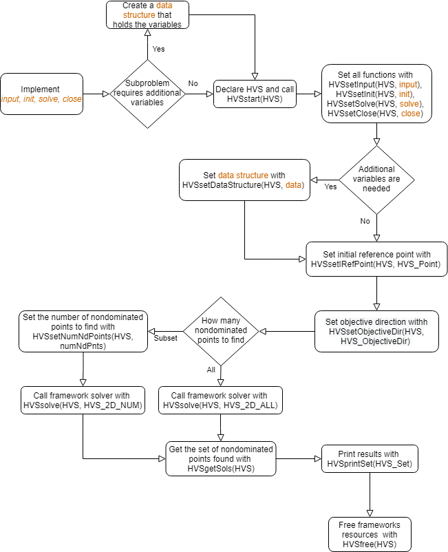

# HVScalar: A C++ framework for biobjective optimization

This repository contains a C++ framework that implements a dichotomic search to solve any biobjective optimization problem that can be formulated in terms of hypervolume scalarization. The problem can be implemented using [SCIP Optimization Suite](https: * scipopt.org/#scipoptsuite) as a MILP solver or implemented as a dedicated problem.

The framework is capable of finding and returning the complete set of nondominated solutions or a subset of the nondominated set with an approximation guarantee.

## Usage

The framework is currently provided as a single header file. In order to use it, you must copy `hvscalar.h`, include it in the `.cpp` files and follow the implementation instruction that are provided below.

For an implementation example, see the [Example](/Example) folder.

## Overview of Available Functions

The framework currently uses one structure, `HVS` to store all the necessary data. This structure holds information about all the user implemented functions and basic information about the problem such as the number of nondominated points to find, if set, the objective direction, either maximization or minimization, the initial reference point and the data structure created by the user. It is required as input by all the frameworks functions.

We consider the following variables
```cpp
#define HVS_Eps     1e-8                 /**< Epsilon value */
#define HVS_Inf     1e+20                /**< Default value considered to be infinity */
#define HVS         struct HVSdata       /**< Main data structure */
#define HVS_Point   std::vector<double>  /**< A point */
#define HVS_Set     std::set<std::shared_ptr<HVS_Point>, Comp2DSetS>  /**< A set of points */
enum HVS_ObjectiveDir {
    HVS_MAX = 1,       /**< sets the objective as maximization */
    HVS_MIN = -1       /**< sets the objective as minimization */
};
enum HVS_SolveType{
    HVS_2D_ALL = 1001,     /**< sets the solving mode to find all nondominated points */
    HVS_2D_NUM,            /**< sets the solving mode to find a subset of all nondominated points */
};
```

The following functions are available:

### HVSstart

```cpp
/** Initiates the HVScalar data structure and sets variables to default values
 * 
 *  Parameters:
 *    HVS - An uninitialized HVS data structure
 */ 
void HVSstart(HVS);
```

### HVSfree

```cpp
/** Frees the HVScalar data structure and all associated data
 * 
 *  Parameters:
 *    HVS - An initialized HVS data structure
 */ 
void HVSfree(HVS);
```

### HVSsetInput

```cpp
/**  Sets the user built function that reads inputs for the problem
 * 
 *  Parameters:
 *    HVS   - An initialized HVS data structure
 *    input - User implemented function that reads the problems input
 */ 
void HVSsetInput(HVS, input);
```

### HVSsetInit

```cpp
/** Sets the user built function that initiates the problem and perform necessary pre-calculations
 *  
 *  Parameters:
 *    HVS  - An initialized HVS data structure
 *    init - User implemented function that initializes the problem and all the necessary variables
 */ 
void HVSsetInit(HVS, init);
```

### HVSsetSolve

```cpp
/** Sets the user built function that solves an instance of the subproblem
 * 
 *  Parameters:
 *    HVS   - An initialized HVS data structure
 *    solve - User implemented function that solves a version of the problem and returns the best point calculated
 */ 
void HVSsetSolve(HVS, solve);
```

### HVSsetClose

```cpp
/** Sets the user built function that closes the problem and frees all data associated
 *  
 *  Parameters:
 *    HVS   - An initialized HVS data structure
 *    close - User implemented function that frees all variables associated with the problem
 */ 
void HVSsetClose(HVS, close);
```

### HVSsetDataStructure

```cpp
/** Sets the user implemented data structure for the problem
 * 
 *  Parameters:
 *    HVS               - An initialized HVS data structure
 *    problemVariables  - User implemented data structure that contains the problems variables
 */ 
void HVSsetDataStructure(HVS, problemVariables);
```

### HVSsetIRefPoint

```cpp
/** Sets the initial reference point to be used by the solving process
 * 
 *  Parameters:
 *    HVS        - An initialized HVS data structure
 *    iRefPoint  - A point that is considered as the initial reference point
 */ 
void HVSsetIRefPoint(HVS, iRefPoint);
```

### HVSsetObjectiveDir

```cpp
/** Sets the objective direction of the problem
 * 
 *  Parameters:
 *    HVS              - An initialized HVS data structure
 *    HVS_ObjectiveDir - Value representing the objective of the function, HVS_MAX for maximization and HVS_MIN for minimization,
 */ 
void HVSsetObjectiveDir(HVS, HVS_ObjectiveDir);
```

### HVSsetNumNdPoints

```cpp
/** Sets the number of nondominated points to be calculated
 * 
 *  Parameters:
 *    HVS         - An initialized HVS data structure
 *    numNdPoints - Integer value indicating the number of nondominated points to calculate, only used when HVS_2D_NUM is selected as the solving method
 */ 
void HVSsetNumNdPoints(HVS, numNdPoints);
```

### HVSsetVerbose

```cpp
/** Sets the verbosity mode
 * 
 *  Parameters:
 *    HVS     - An initialized HVS data structure
 *    verbose - A boolean. If set to True, additional information will be displayed during the solving process
 */ 
void HVSsetVerbose(HVS, verbose);
```

### HVSgetIRefPoint

```cpp
/** Obtain the current initial reference point
 * 
 *  Parameters:
 *    HVS - An initialized HVS data structure
 *    
 *  Returns:
 *    HVS_Point - The point set as initial reference point
 */ 
HVS_Point HVSgetIRefPoint(HVS);
```

### HVSgetDataStructure

```cpp
/** Obtain the data structure of the problem.
 * 
 *  Parameters:
 *    HVS   - An initialized HVS data structure
 * 
 *  Returns:
 *    void* - The data structure for the problem
 *  
 *  Note:
 *    As the returned type is void*, it must be cast to the correct data structure type
 */
void* HVSgetDataStructure(HVS);
```

### HVSsolve

```cpp
/** Calculates the nondominated points using the dichotomic scheme 
 * 
 *  Parameters:
 *    HVS           - An initialized HVS data structure
 *    HVS_SolveType - Solving method for the problem
 */ 
void HVSsolve(HVS, HVS_SolveType);
```

### HVSgetSols

```cpp
/** Obtain the set of solutions of the dichotomic scheme
 * 
 *  Parameters:
 *    HVS - An initialized HVS data structure
 * 
 *  Returns:
 *    HVS_Set - The set of nondominated points found
 */ 
HVS_Set HVSgetSols(HVS);
```

### HVSprintSet

```cpp
/** Prints the given set of points
 * 
 *  Parameters:
 *    HVS_Set -  The HVS_Set to be displayed
 */ 
void HVSprintSet(HVS_Set);
```

## Implementing steps

1. Implement functions input, init, solve and close. These functions are responsible for reading all the inputs necessary, initializing the problem, solving an instance of the problem and freeing all the resources allocated to the problem, respectively.

2. If additional variables are needed in order to solve a subproblem, excluding the reference point, create a data structure that holds all the required variables associated to the implemented problem.

3. On the main() function, declare the main data structure HVS and initialize it by calling HVSstart(HVS).

4. Set all the user implemented functions on the framework by calling, in any order, HVSsetInput(HVS, input), HVSsetInit(HVS, init), HVSsetSolve(HVS, solve), HVSsetClose(HVS, close), and HVSsetDataStructure(HVS, data).

5. In order to set the initial reference point, the function HVSsetIRefPoint(HVS, HVSPoint) should be called. The objective of the problem should also be set using function HVSsetObjectiveDir(HVS, HVS_ObjectiveDir).

6. If the user wants to calculate a specific number of nondominated points, they must call function HVSsetNumNdPoints(HVS, numNdPnts), with numNdPnts being an integer of how many points to calculate.

7. With all necessary variables set, function HVSsolve(HVS, HVS_SolveType) should be called. This will run the method chosen.

8. The results can be obtained by using function HVSgetSols(HVS), which returns a HVS_Set, and displayed using function HVSprintSet(HVS_Set).

9. Lastly, the function HVSfree(HVS) must be called to release all the frameworks variables.

<p align="center">
  
</p>
